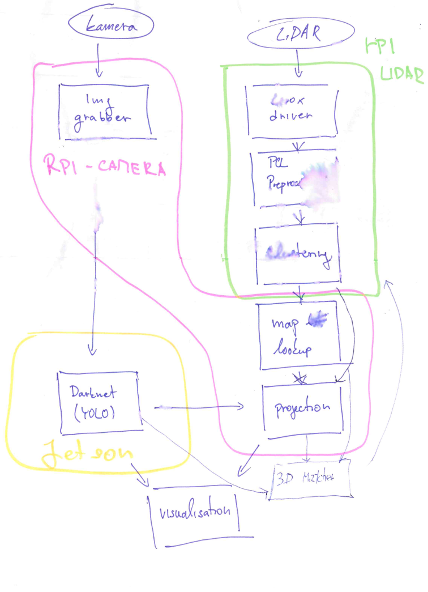
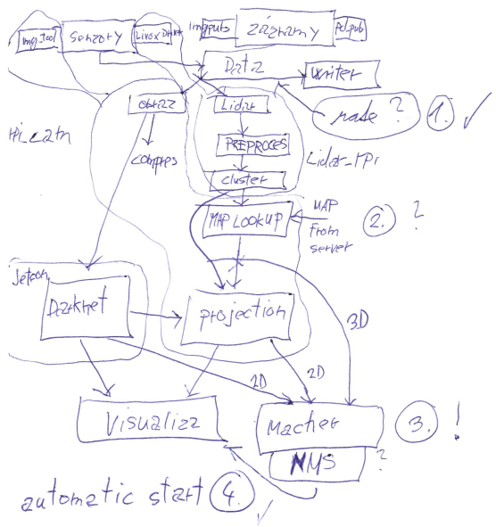

# ROS2 workspace for project ai4di
 This repository was created for project ai4di. The setup of this project was designed for 3  constrained units (2x Raspberry pi and one jetson Nano). As default all packages have COLCON_IGNORE, in order to compile modules, it is necessary to remove them.
 
 The repository organization is in folders:
 - daemon - scripts and services relevant to automatiated run
 - launch - ROS2 launching scripts
 - maps - maps for navigation bringup
 - model - darknet YOLOv3 model
 - params - ROS2 params files
 - src - pakages sources
 - doc - images for readme

Cloning repository:
```
git clone --recurse-submodules https://github.com/LukasKratochvila/ros2-ws-ai4di.git
```

# Building ROS 2 and Colcon
 Build should work with ROS 2 Foxy. On constrained devices, it is necessary to build packages one by one.
```
cd ros2-ws-ai4di/
source <ROS 2 Foxy>(ususally: /opt/ros/foxy/install/setup.bash)
colcon build --cmake-args -DCMAKE_BUILD_TYPE=Release --symlink-install
source install/setup.bash
```
# Overview
<p align="center">
  
  
</p>

## Packages

| Package | Description | Status | Language |
| :---: | :---: | :---: | :---: |
| border_checker | Module for filtering point cloud and finding the border | Old - Unused | C++ |
| clustering | Module for finding clusters in the point cloud | Used | C++ |
| darknet_vendor | Subrepository for CNN framework | Used | C++ |
| detection_matcher_py | Module for finding correspondence between point cloud msgs and images msgs | Used | Python |
| detection_vizualizer | Visualisation of detections msgs | Optional | Python |
| image_tools_custom | Image grabber module | Used | C++ |
| img_pub_py | Image publisher module for visualization saved data | Optional | Python |
| livox_ros2_driver | Lidar grabber module | Used | C++ |
| map_lookup | Module for comparison detections with map | Used | C++ |
| openrobotics_darknet_ros | YOLOv3 realizer | Used | C++ |
| pcl_preprocessing | Filtering and preprocessing the point cloud data module | Used | C++ |
| pcl_pub_cpp | The point cloud publisher module for visualization saved data | Used | C++ |
| projection | YOLO detections projector module | Used | C++ |
| tracker | 3D detection tracker based od deepSORT method | Used | Python |
| writer_cpp | Data saving module | Optional | C++ |
